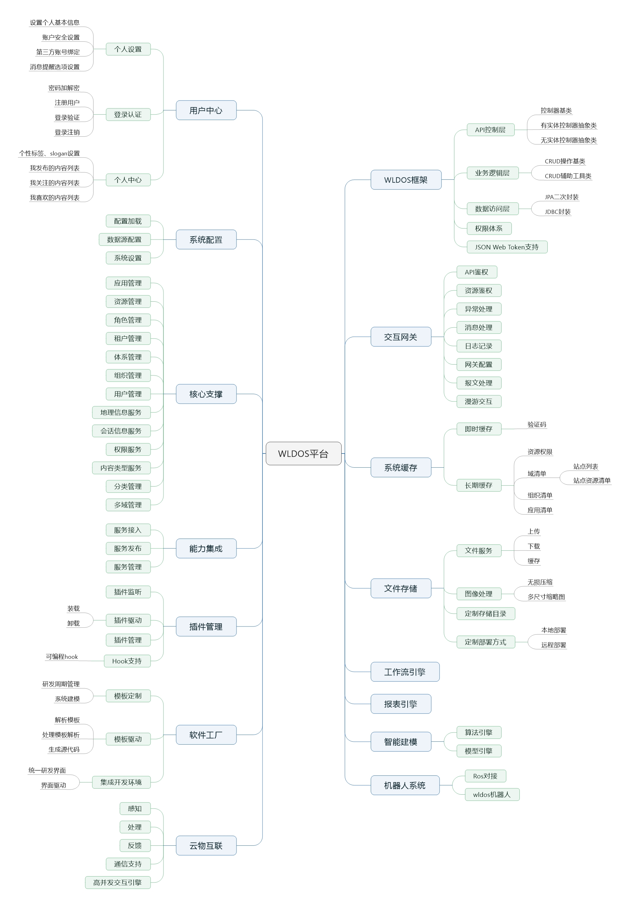
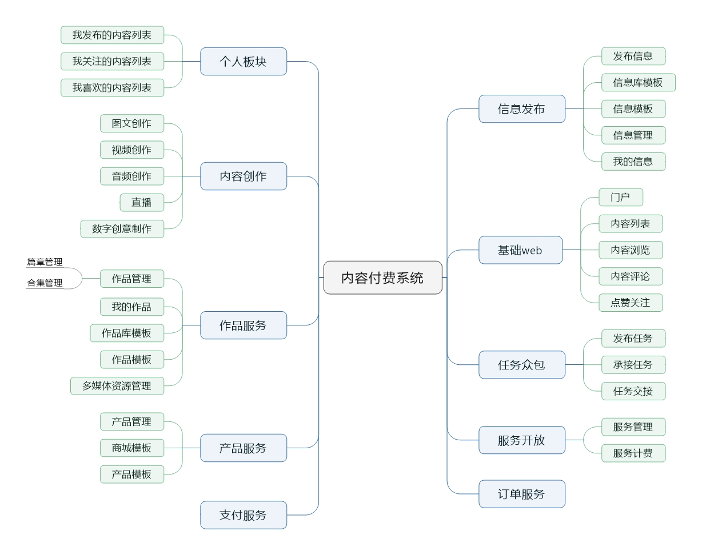

<p align="center">
 
</p>
<h3 align="center" style="margin:30px 0 30px;font-weight:bold;font-size:30px;">云应用支撑平台 - 云物互联驱动</h3>
<p align="center">
 <a href="https://wldos.com/" target="__blank"></a>
 <a href="https://spring.io/projects/spring-boot#learn" target="__blank"></a>
 <a href="https://gitee.com/wldos/wldos/stargazers" target="__blank"></a>
 <a href="https://gitee.com/wldos/wldos/members" target="__blank"></a>
</p>    

### WLDOS源起

元宇宙的概念炒得火热，现在发现其中很多理念与曾经的创想不谋而合，身为码农该做点什么——后生晚学奋起直追，犹未为晚。WLDOS（World Operating System）算是为了这样的目标而作的涂鸦，如此拙劣而平凡的“小板凳”，尚需在实际应用中不断打磨和沉淀。在研发过程中，一步步探求我们最引以为傲的“乌托邦”，然后实现它、驱动它，直到托起更美好的世界！

为让此项目更快浮出水面帮助需要的人，请<a href="https://gitee.com/wldos/wldos" style="color: red">star</a>我们，多谢!

### 项目特点

1.干净：框架底层仅引用了springboot等开源包，开发框架会持续优化，在此基础上实现了支撑平台，避免了引入spring全家桶所造成的噪声，按需自研、从零开始有利于开发团队、项目的积累和成长。

2.完整：包含底层到业务应用的完整产品线，是云物互联背景下的小有规模的最佳实践，不迷信业内各种高大上的轮子，崇尚自主研发，为解决实际问题而自研有利于自然成长，虽"土"，但够自由。  

3.真实：自主研发、自主运营，研发与运营同时进行的模式更务实，不做KPI，现实应用驱动，用什么，做什么。
  
项目尚浅陋，会慢慢成熟，You can believe！

#### 技术交流

QQ 群：830355512   
公众号：wldos  


### 项目介绍

WLDOS云应用支撑平台，简称WLDOS平台，本仓库是wldos平台后端工程。基础型新项目，适合新手跟随学习。  
WLDOS是world operate system的缩写，表示驱动世界的操作系统，理念是简化世界复杂度，用一套系统协助支撑所有业务。  
WLDOS是类SaaS的云支撑平台，与SaaS的区别在于目标是托起云物互联，基于token认证的前后端分离应用架构，支持多租户、多站点、多应用，是云平台和物联网的融合实现。

**适合个人建站、企业建站、搭建业务中台的基础、研发平台，适合技术在起步阶段或想在云物互联领域开发项目的团队。**

关于发音  
为统一发音，简拼WLDOS采用汉语拼音：[wo'dao'si] 或 [wou da si]。

演示地址：<a href="http://www.shuxiyuan.com/user/login?redirect=http%3A%2F%2Fshuxiyuan.com%2Fadmin%2Fres%2Fapp">点击前往</a>（演示环境版本略低于社区版）

###技术说明  
语言：Java8、ReactJs17。
框架：springboot2.4.6（支持升级到最新）。  
ORM：spring-data-jdbc2.1.9，连接池采用boot自带hikari。  
前端：ReactJs17，AntD ProV4.5。  
中间件：tomcat9（支持换成其他）。  
辅助：自带cache、自带JWT、自带文件服务。
兼容性：后端jdk1.8，前端IE11+、Google Chrome、Edge等。

应用架构：前后端分离，前端ReactJs，后端springMVC(2.0推出webflux架构版)，JWT认证，无状态，原生兼容springCloud，支持融入serviceMesh。

**1.0核心功能：系统管理（应用、资源、权限、用户、组织、租户、多域、分类），内容管理，信息发布，内容创作、内容付费（在线付费、在线交付）。**

**2.0规划功能：服务集成与开放能力、插件扩展管理能力、类serviceMesh Ad-hoc架构支撑能力。**  

**3.0规划功能：软件工厂、云物互联支撑能力、智能建模与机器人系统。**

### 功能模块

WLDOS是个软件家族，目前由开发框架、支撑平台和内容管理三大版块构成，组成两个项目模块：WLDOS云应用支撑平台和WLDOS内容管理系统，如下：



### 安装教程

先部署后端：
1.  后端工程下载到本地，用idea打开项目。
2.  安装mysql数据库脚本，生成数据库。数据库脚本请进下方的qq群自行下载。   
    设置文件存储位置，默认E:\\Temp，如要修改，在wldos-platform下找properties中相应选项配置  
    把zone目录下的store.rar解压到设置的文件存储位置，store为指定存储位置下的一级目录，里面有  
    演示数据对应的图片，如果不设置相关图片显示404。
3.  项目更新maven库。服务器端口号默认8080。
4.  在ide控制台执行mvn clean install -pl com.wldos:wldos-web -am -DskipTests
    安装项目；  
    目前开放6个模块：  
    wldos-common：通用模块  
    wldos-framework：wldos开发框架（为了wldos的稳定和安全，采用本地lib/jar分发，请使用安装本地jar的方法安装到maven本地仓库，jar坐标见内部pom文件）  
    wldos-platform-base：wldos支撑平台基础（为了wldos的稳定和安全，采用本地lib/jar分发，请使用安装本地jar的方法安装到maven本地仓库，jar坐标见内部pom文件）  
    wldos-platform: wldos支撑平台    
    wldos-kpaycms: 为支撑平台基础上开发的内容付费管理系统，如果只需要支撑平台，可以仅运行wldos-platform模块，启动后在系统管理后台-资源管理清除cms的菜单；    
    wldos-web：项目入口模块，资源配置，打war包或可执行jar从这里开始。  
    
    安装数据库，数据库脚本在wldos-web/db下，默认mysql5.7，数据库用户名、密码见wldos-web/resources/application-dev.properties。
    数据库正常运行后，以下命令启动项目：  
    安装依赖jar到本地仓库：  
    mvn install:install-file -Dfile=./lib/wldos-framework-1.0-release.jar -DgroupId=com.wldos -DartifactId=wldos-framework -Dversion=1.0 -Dpackaging=jar -DpomFile=./lib/maven/wldos-framework/pom.xml  
    mvn install:install-file -Dfile=./lib/wldos-platform-base-1.0-release.jar -DgroupId=com.wldos -DartifactId=wldos-platform-base -Dversion=1.0 -Dpackaging=jar -DpomFile=./lib/maven/wldos-platform-base/pom.xml  
      
    启动项目：  
    mvn -pl com.wldos:wldos-web spring-boot:run 启动cms和支撑平台。  
    
    部署前端：
1.  下载本地后，打开前端项目，执行tyarn安装依赖js库。
2.  执行npm start启动前端项目，npm build执行打包编译。前端访问路径：http://localhost:8000
3.  超级管理员admin，密码同名称。

### 使用说明

1. 浏览器访问localhost:8000,用户名、密码都是admin,注意浏览器要使用谷歌浏览器、IE11可能有卡顿。
2. 点击左侧管理菜单，使用系统管理功能。
3. 登陆使用JWT认证。

### 效果预览

说明：模块包含支撑平台 和 内容管理系统，后者依赖于前者，请根据需求取舍。

### 开源协议与商用许可  

为了WLDOS平台的独特性和可持续，已申请软件著作权证书，已开发源代码采用Apache2.0协议可商用。
本社区版默认免费使用，但是限制用户数，如需专业版请购商业授权。

商用或合作请去：https://www.wldos.com

*附：*
#### 项目结构

````
wldos根目录
├─common----------------------------------------wldos-common通用模块
│  ├─src----------------------------------------通用模块源码包
│  │  ├─main
│  │  │  ├─java
│  │  │  │  └─com
│  │  │  │      └─wldos
│  │  │  │          └─common
│  │  │  │              ├─dto-------------------通用数据传输类
│  │  │  │              ├─enums-----------------通用枚举类
│  │  │  │              ├─exception-------------全局异常基础包
│  │  │  │              ├─res-------------------通用响应模板
│  │  │  │              ├─utils-----------------通用工具类
│  │  │  │              │  ├─captcha------------验证码相关
│  │  │  │              │  ├─domain-------------域操作相关
│  │  │  │              │  ├─encrypt------------加密解密类
│  │  │  │              │  ├─http---------------http相关
│  │  │  │              │  └─img----------------图片处理类
│  │  │  │              └─vo--------------------通用视图类
│  │  │  └─resources----------------------------静态资源包
│  │  └─test------------------------------------单元测试包
│  └─target-------------------------------------编译打包输出目录
├─lib-------------------------------------------本地依赖jar
│  └─maven--------------------------------------本地jar的pom文件目录
│      ├─wldos-framework------------------------wldos框架pom文件目录
│      └─wldos-platform-base--------------------wldos平台基础包pom文件目录
├─modules---------------------------------------功能模块目录
│  ├─kpaycms------------------------------------wldos内容付费管理系统
│  │  ├─src-------------------------------------内容付费系统源码包
│  │  │  ├─main
│  │  │  │  ├─java
│  │  │  │  │  └─com
│  │  │  │  │      └─wldos
│  │  │  │  │          ├─book-------------------内容付费实现包(coding)
│  │  │  │  │          │  ├─controller
│  │  │  │  │          │  ├─entity
│  │  │  │  │          │  ├─repo
│  │  │  │  │          │  ├─service
│  │  │  │  │          │  └─vo
│  │  │  │  │          └─cms--------------------内容管理基础包
│  │  │  │  │              ├─controller
│  │  │  │  │              ├─dto
│  │  │  │  │              ├─entity
│  │  │  │  │              ├─enums
│  │  │  │  │              ├─model
│  │  │  │  │              ├─repo
│  │  │  │  │              ├─service
│  │  │  │  │              └─vo
│  │  │  │  └─resources-------------------------静态资源包
│  │  │  └─test---------------------------------平台单元测试包
│  │  └─target----------------------------------编译打包输出目录
│  └─platform-----------------------------------wldos云应用支撑平台
│      ├─src------------------------------------平台源码包
│      │  ├─main
│      │  │  ├─java
│      │  │  │  └─com
│      │  │  │      └─wldos
│      │  │  │          ├─auth------------------登录鉴权授权包
│      │  │  │          │  ├─controller---------登录鉴权授权包
│      │  │  │          │  ├─dto----------------登录相关数据传输类
│      │  │  │          │  ├─enums--------------登录相关枚举值
│      │  │  │          │  ├─model--------------登录相关模型
│      │  │  │          │  ├─service------------登录相关业务层
│      │  │  │          │  └─vo-----------------登录相关实体类
│      │  │  │          ├─conf------------------平台参数配置包
│      │  │  │          ├─handler---------------全局处理器
│      │  │  │          └─sys-------------------平台系统包目录
│      │  │  │              └─core--------------平台核心实现驱动包
│      │  │  │                  ├─controller----平台核心控制层
│      │  │  │                  ├─entity--------平台核心模型实体类
│      │  │  │                  ├─repo----------平台核心数据仓库层
│      │  │  │                  ├─service-------平台核心业务层
│      │  │  │                  └─vo------------平台核心模型视图类
│      │  │  └─resources------------------------静态资源包
│      │  └─test--------------------------------平台单元测试包
│      └─target---------------------------------编译打包输出目录
├─wldos-web-------------------------------------项目web入口模块
│  ├─db-----------------------------------------平台数据库脚本
│  ├─src
│  │  ├─main
│  │  │  ├─java
│  │  │  │  └─com
│  │  │  │      └─wldos-------------------------web入口包
│  │  │  └─resources----------------------------最终资源包
│  │  │      └─resources------------------------静态资源包
│  │  │          └─store------------------------自带资源包
│  │  └─test------------------------------------单元测试包
│  └─target-------------------------------------编译打包输出目录
└─zone------------------------------------------测试静态资源包
````